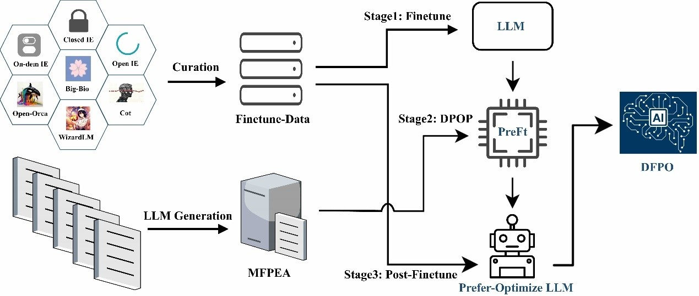
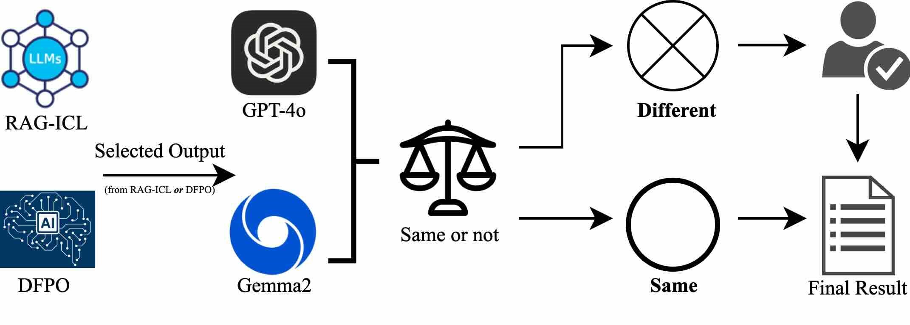

<h1>Enhancing Biomedical Named Entity Recognition and Relation Extraction with RAG-ICL and DFPO</h1>

<p align="center">
    <a 
        href="">
    </a>
    <a href="https://huggingface.co/liyinghong/DFPO-Gemma2">
        
    </a>
</p>

<p align="justify">
    This repository provides code for the RAG-ICL and DFPO methods. RAG-ICL is based on the concept of Retrieval-Augmented Generation (RAG), optimizing in-context learning by selecting high-quality examples. <br>
    <b>DFPO</b> (<b>D</b>ual-phase <b>F</b>ine-tuning and <b>P</b>reference <b>O</b>ptimization), on the other hand, uses a "two-stage fine-tuning and preference optimization" strategy, specifically designed for the data structure of biomedical information extraction tasks. It gradually strengthens the model's performance on positive samples and enhances overall effectiveness through preference optimization. Experimental results show that both methods achieve significant improvements over traditional approaches.
    <ul>
        <li>
            📖 Paper: <a href="">Enhancing Biomedical Named Entity Recognition and Relation Extraction with RAG-ICL and DFPO</a>
        </li>
        <li>
            🤖 Model availiable: <a href="https://huggingface.co/liyinghong/DFPO-Gemma2">Gemma2-DFPO</a>
        </li>
        <li>
            📁 PreFinetune Data and MFPEA:
            <a href="https://huggingface.co/datasets/liyinghong/DFPO-Preft-taiyi">DFPO-PreFinetune-Data1</a>
            <a href="https://huggingface.co/datasets/liyinghong/DFPO-Preft-adelie">DFPO-PreFinetune-Data2</a>
            <a href="https://huggingface.co/datasets/liyinghong/DFPO-MFPEA">MFPEA</a>
        </li>
    </ul>
</p>
<h3>Graphical Abstract</h3>
<p align="center">
    
</p>
<h3>RAG-ICL Flowchart</h3>
<p align="center">
    
</p>
<h3>DFPO Flowchart</h3>
<p align="center">
    
</p>
<h3>DMCR Flowchart</h3>
<p align="center">
    
</p>

<h2>Prerequisites</h2>
<ul>
    <li>Python 3.10 or higher</li>
    <li>PyTorch</li>
    <li>langchain</li>
    <li>transformers</li>
    <li>peft</li>
    <li>bitsandbytes</li>
    <li>accelerate</li>
    <li>deepspeed</li>
</ul>

Install the required packages using:
<pre><code>pip install -r requirements.txt</code></pre>

<h2>Directory Structure</h2>

```
.
├── assets/
│   ├── DFPO.jpg
│   ├── DMCR.jpg
│   ├── Graphical Abstract.png
│   └── RAG-ICL.jpg
├── README.md
├── requirements.txt
└── scripts/
    ├── DFPO/
    │   ├── finetune.py
    │   └── prefer_optimize.py
    ├── generate_data.py
    └── RAG-ICL/
        └── best_examples.py
```

## Description of Contents

### assets/

It includes the flowcharts of the RAG-ICL, DFPO and DMCR methods, as well as the graphical abstract diagram of this study.

### README.md

This file, providing an overview and instructions for the repository.

### requirements.txt

This document lists all the dependencies required for running the scripts in this repository.

### scripts/

- **DFPO/**
  - **finetune.py**: This script is used for stage 1: Finetune and stage 3: Post-Finetune of DFPO. Users are required to download the model for fine-tuning in advance and specify the path of the model. This script will automatically download the dataset required for the fine-tuning of DFPO and perform preprocessing (the template of the tokenizer is the chat_template of gemma2. If you need the chat_template of other models, please modify it manually). Subsequently, the model will be fine-tuned.
  - **prefer_optimize.py**: This script will automatically download the MFPEA dataset required for the stage 2 preference optimization of DFPO and perform preprocessing. Subsequently, based on the DPOTrainer of the trl library, the DPOP algorithm will be used for preference optimization. It should be noted that the DPOP algorithm has not been inherited in the trl library currently, and users need to make certain modifications. Please refer to the [Reminder](#Reminder) for the specific modifications.
- **generate_data.py/**: Running this script will download the eight open-source datasets used in the RAG-ICL method of this study. The download address is the dataset hosted by the bigbio project on HuggingFace. The script will generate a "data" directory in the current path, which contains a "raw" subdirectory (the dataset directly downloaded from the bigbio project) and a "collate" subdirectory (the dataset preprocessed by the script).
- **RAG-ICL/**
  - **best_examples.py**:This script requires users to download the embedding model and rerank model in advance and provide their paths. The script will perform RAG screening on the dataset in the collate subdirectory generated by generate_data.py, select training set samples with high relevance for each test set sample, match the test set samples with the document IDs of the training set samples, and generate a best_example.json file saved in the RAG-ICL directory.

<h2>Runing</h2>
<h3>RAG-ICL</h3>

<p>Running the following command will download and process the datasets used in the RAG-ICL method of this study.</p>

```
python ./scripts/generate_data.py --all
```

<p>A "Data" directory will be generated in the local path.</p>

```
.
├── collate
│   ├── ner
│   │   ├── bc5cdr_chemical
│   │   │   ├── bc5cdr_chemical_test_processed.json
│   │   │   └── bc5cdr_chemical_train_processed.json
│   │   ├── bc5cdr_disease
│   │   │   ├── bc5cdr_disease_test_processed.json
│   │   │   └── bc5cdr_disease_train_processed.json
│   │   ├── chemdner
│   │   │   ├── chemdner_test_processed.json
│   │   │   └── chemdner_train_processed.json
│   │   ├── ncbi_disease
│   │   │   ├── ncbi_disease_test_processed.json
│   │   │   └── ncbi_disease_train_processed.json
│   │   └── nlm_gene
│   │       ├── nlm_gene_test_processed.json
│   │       └── nlm_gene_train_processed.json
│   └── re
│       ├── bc5cdr
│       │   ├── bc5cdr_test_processed.json
│       │   └── bc5cdr_train_processed.json
│       ├── biorelex
│       │   ├── biorelex_test_processed.json
│       │   └── biorelex_train_processed.json
│       └── ddi_corpus
│           ├── ddi_corpus_test_processed.json
│           └── ddi_corpus_train_processed.json
└── raw
    ├── bc5cdr/
    ├── biorelex/
    ├── chemdner/
    ├── ddi_corpus/
    ├── ncbi_disease/
    └── nlm_gene/
```

<p>Running the following command will execute the RAG-ICL method to screen out high-quality examples.</p>

```
python ./scripts/RAG-ICL/best_examples.py \
    --task "ner" \
    --one_dataset "bc5cdr" \
    --embedding_model_path /path/to/your/embedding_model \
    --rerank_model_path /path/to/your/rerank_model \
    --search_type "similarity" \
    --k 30 \
    --score_threshold 0.79 \
```

<h3>DFPO</h3>
The training of DFPO consists of three stages in total.

#### Stage 1 Pre-Finetune OR Stage 3 Post-Finetune

1. **Load and Filter Data:**
    - Load dataset from the Huggingface repository of DFPO.
    - Filter and preprocess the data.
    - By default, use Gemma2's chat template to tokenize the dataset.

2. **Model Setup:**
    - Load the pre-trained model and tokenizer.
    - Configure BitsAndBytes for efficient training.
    - Prepare the model for QLoRA/LoRA training.

3. **Training Configuration:**
    - Define training arguments.
    - Create a Trainer instance and start training.

```
accelerate launch ./scripts/DFPO/finetune.py \
    --modelpath /path/to/your/Base_Gemma2_model \
    --datapreprocess \
    --epoch 5 \
    --batchsize 1 \
    --gradient_accumulation_steps 8 \
    --lr_scheduler_type "constant_with_warmup" \
    --learning_rate 2e-4 \
    --output_dir "../../result" \
```

#### Stage 3 Preference optimization of DPOP

1. **Load Data:**
    - Load MFPEA dataset from the Huggingface repository of DFPO.
    - preprocess the data.
    - By default, use Gemma2's chat template to tokenize the dataset.

2. **Model Setup:**
    - Load the pre-trained model and tokenizer.

3. **Training Configuration:**
    - Define DPOP and QLoRA/LoRA training arguments.
    - Create a Trainer instance and start training.

```
accelerate launch ./scripts/DFPO/prefer_optimize.py \
    --modelpath /path/to/your/PreFt_Gemma2 \
    --beta 0.4 \
    --max_length 2048 \
    --max_prompt_length 512 \
    --learning_rate 2e-7 \
    --loss_type dpop \
    --dpop_lambda 2 \
    --output_dir "../../DFPO_result" \
```

<h2>Reminder</h2>
<p>
    The <a href="https://github.com/abacusai/smaug">DPOP</a> algorithm has not yet been integrated into Huggingface's trl library and needs to be implemented manually in DPOTrainer.
</p>
<p>The following is the implementation of DPOP loss</p>

```
       pi_logratios = policy_chosen_logps - policy_rejected_logps
       logits = pi_logratios - ref_logratios
       penalty_term = torch.maximum(torch.zeros_like(policy_chosen_logps), reference_chosen_logps - policy_chosen_logps)
       logits += - self.lambda * penalty_term

            losses = (
                -F.logsigmoid(self.beta * logits) * (1 - self.label_smoothing)
                - F.logsigmoid(-self.beta * logits) * self.label_smoothing
            )
```
